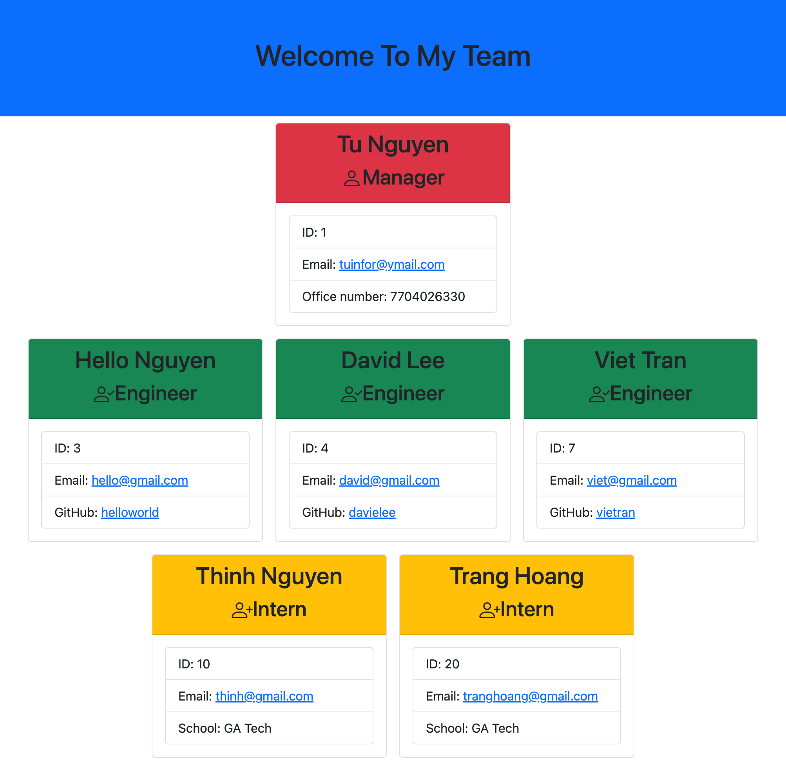

# Team Generator

https://github.com/vi3t4lov3/Professional-README-Generator

## Description

this project was to create a command line program that would dynamically generate an HTML webpage based on user inputs. The two Javascript libraries used to achieve this were inquirer and fs. By utilizing Javascript alone a quick file generator was able to be created that utilized new concepts like command line user interaction and file creation.

## Table of Contents

- [Description](#description)
- [Table of Contents](#table-of-contents)
- [Dependencies](#dependencies)
- [Installation](#installation)
- [Usage](#usage)
- [Contribute](#contribute)
- [Tests](#tests)
- [Demo](#demo)
- [Questions](#questions)
- [License](#license)

## Dependencies

- HTML
- CSS, Bootstrap
- Javascript (OOP, Node.js, Inquirer, Jest)

## Installation

You can run a local copy of this site by issuing the following commands.

```bash
$ git clone https://github.com/vi3t4lov3/Teams-Generator.git
$ cd Teams-Generator
```

## Usage

```md
GIVEN a command-line application that accepts user input
WHEN I am prompted for my team members and their information
THEN an HTML file is generated that displays a nicely formatted team roster based on user input
WHEN I click on an email address in the HTML
THEN my default email program opens and populates the TO field of the email with the address
WHEN I click on the GitHub username
THEN that GitHub profile opens in a new tab
WHEN I start the application
THEN I am prompted to enter the team manager’s name, employee ID, email address, and office number
WHEN I enter the team manager’s name, employee ID, email address, and office number
THEN I am presented with a menu with the option to add an engineer or an intern or to finish building my team
WHEN I select the engineer option
THEN I am prompted to enter the engineer’s name, ID, email, and GitHub username, and I am taken back to the menu
WHEN I select the intern option
THEN I am prompted to enter the intern’s name, ID, email, and school, and I am taken back to the menu
WHEN I decide to finish building my team
THEN I exit the application, and the HTML is generated
```

## Contribute

1. Fork it
2. Create your feature branch (`git checkout -b my-new-feature`)
3. Commit your changes (`git commit -am 'Add some feature'`)
4. Push to the branch (`git push origin my-new-feature`)
5. Create new Pull Request

## Tests
```
npm run test
```
## Demo

[Click here] (https://github.com/vi3t4lov3/Teams-Generator)

[Click here] (https://youtu.be/n4YY_3uE4e8)



## Questions

If you have questions about this repository reach me by Github: [vi3t4lov3](https://github.com/vi3t4lov3)
or send an email: tuinfor@ymail.com

## License

[](https://opensource.org/licenses/MIT)
